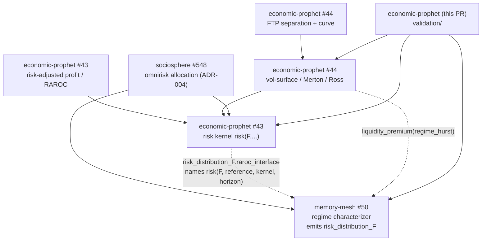

# Financial-spine index (anti-fragmentation map)

One place that names **every module of the estate financial spine, its canonical
home, and the soft-reference graph between them.** The spine is *reference-gated*:
each module consumes its neighbours by contract (a shape / an interface name), not
by forking their code. This index is how we keep it from fragmenting into parallel
re-implementations.

Status legend: **merged** = landed on `main`; **in-flight** = specified / on a
branch, not yet a numbered PR (canonical home reserved here so it lands in place).

## Merged modules

| Module | Canonical home | PR | Contract |
|---|---|---|---|
| **Risk-measure kernel** — one `risk(F, kernel, reference, horizon, ...)` interface over a loss distribution `F` (Sharpe / Sortino / Kappa / VaR / ES / spectral), Euler allocation, structural tranche transform | `economic-prophet` · `src/open_ep_framework/risk_measures.py` | economic-prophet **#43** | RM-1 / RAP-1 / TC-1 |
| **Risk-adjusted profit / RAROC** — risk-adjusted profit contract reconciling economic vs epistemic capital | `economic-prophet` · `src/open_ep_framework/risk_adjusted_profit.py` | economic-prophet **#43** | RAP-1 |
| **FTP separation + curve** — matched-maturity funds-transfer-pricing separation, hedges, infinite-duration curve | `economic-prophet` · `src/open_ep_framework/ftp.py`, `ftp_curve.py` | economic-prophet **#44** | FTP-1 / HDG-1 |
| **Market instruments** — Black-76, vol-surface (Breeden–Litzenberger `F_Q`), **Merton** structural bridge, **Ross** risk-neutral→physical seam, liquidity premium | `economic-prophet` · `src/open_ep_framework/market_instruments.py` | economic-prophet **#44** | MKT-1 |
| **Omnirisk allocation** — cross-cut risk aggregation/allocation over an arbitrary hierarchy cut (conservation, coherence, regime binding) | `sociosphere` · `gbrg/docs/ADR-004-omnirisk-architecture.md` | sociosphere **#548** | OMNI-1 |
| **Memory-regime characterizer** — classifies a series by memory regime (Hurst/DFA, Lyapunov, fractal D) and emits a `risk_distribution_F` descriptor | `memory-mesh` · `scripts/memory_regime_estimators.py`, `schemas/memory-regime-characterization.schema.json` | memory-mesh **#50** | MemoryRegimeCharacterization v0.1 |
| **Spine validation** — verified integration + external validity (this PR): cross-consumption teeth + reference-data calibration | `economic-prophet` · `validation/` | *this PR* | consumes RM-1 + MKT-1 + regime-F shape |

## The soft-reference graph

Arrows point **consumer → producer** (A consumes B's contract). Every edge is a
contract seam, not a code fork.

Key seams (verified by `validation/` in this PR):

- **regime-F → kernel.** memory-mesh #50's `risk_distribution_F` descriptor carries
  `"raroc_interface": "risk(F, reference, kernel, horizon)"` — it names the
  economic-prophet kernel directly. `validation/regime_f.py` is the adapter that
  turns a descriptor into a `LossDistribution` the kernel scores. Tooth: a
  fat-tailed regime yields a **strictly larger ES than a Gaussian regime at equal
  variance** (proof the F is actually consumed).
- **market → regime.** `market_instruments.liquidity_premium(volume, regime_hurst)`
  takes the memory regime's Hurst as an injected input (documented, not forked).
- **omnirisk → kernel + regime.** ADR-004 aggregates/allocates coherent capital
  produced by the kernel across a hierarchy, with each leaf bound to a regime.

## In-flight modules (canonical home reserved)

These are specified but **not yet numbered PRs**. Homes are reserved here so they
land in place rather than as parallel re-implementations. Each row states the
contract it will consume.

| Module | Reserved home | Consumes (soft-ref) |
|---|---|---|
| **Microstructure** — order-book / market-impact, effective spread | `economic-prophet` · `market_instruments` neighbour (e.g. `microstructure.py`) | kernel (F), vol-surface, `liquidity_premium` |
| **Crypto** — on-chain / perp funding-rate distribution feed | `economic-prophet` market layer *or* `sociosphere` adapter | kernel (F as a return distribution), regime-F |
| **Capital-concern aggregation** — roll concern/exposure up the estate hierarchy | `sociosphere` · `gbrg` (omnirisk consumer) | omnirisk OMNI-1, kernel Euler allocation |
| **OU-process** — Ornstein–Uhlenbeck mean-reversion generator/estimator | `economic-prophet` risk/regime bridge | memory-mesh `short_decaying`/AR(1) regime, kernel (F) |
| **Jacobs-ladder** — laddered term-structure construction | `economic-prophet` · FTP layer (`ftp_curve` neighbour) | FTP-1 curve, kernel term-structure |
| **Entity-binding** — bind a risk/regime object to a resolved estate entity | identity/ER plane (memory-mesh `consumer_binding` consumer) | regime-F `consumer_binding`, entity resolution |

## How to add a module without fragmenting the spine

1. Find the producer whose contract you need in the table above; **consume the
   contract** (import the interface / read the descriptor shape) — do not copy it.
2. Register the new module here with its canonical home before writing code.
3. Add a `validation/` tooth that asserts the seam actually carries behaviour
   (e.g. swapping the upstream input changes your output), deterministic + stdlib.
